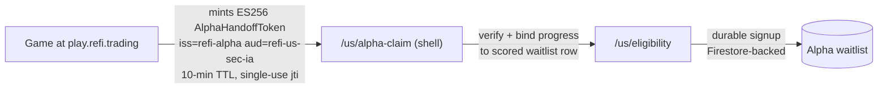

# System integration map — how the game, the landing pages, and Phase 2.6 connect

**Date:** 2026-07-24 · **Owner:** Zeshan · **Companions:**
[`integration-roadmap.md`](integration-roadmap.md) (the work plan),
[`alpha-go-live-checklist.md`](alpha-go-live-checklist.md) (the launch gate).

This is the one-page answer to "how does everything connect." The system is
**two tracks that converge at exactly one point: `/us/eligibility`.** The game
fills the funnel; Phase 2.6 builds what the funnel empties into.

## The four repos and their roles

| Repo                               | Where                                    | Role                                                                                                         |
| ---------------------------------- | ---------------------------------------- | ------------------------------------------------------------------------------------------------------------ |
| `refi-man-vs-machine` ("the game") | `ReFi/game/` · play.refi.trading         | Marketing property / acquisition top-of-funnel. Retro/ASCII register. Mints the AlphaHandoffToken.           |
| `refi-us-sec-ia` (this repo)       | Website/ · refi-us-sec-ia-web.vercel.app | The SEC IA shell: `/us` public pages, eligibility, onboarding, investor portal, BFF. Buttoned-down register. |
| `refi-landing-latest`              | Website/ · refi.trading                  | Marketing site. Today: no game link, no eligibility link. Future: US-geo compliant funnel feeding both.      |
| `refinity-main` (Daniel)           | GitLab                                   | The trading backend. `docs/authoritative/*` is the only doc source of truth (pinned `main @ 9f9dfc9`).       |

## Track 1 — alpha acquisition funnel (the game's job)

- The token carries **game progress only** (arenas, machine-builder stats,
  beat-rate) plus an `intendedDestination`; behavioral dimension scores are
  deliberately excluded (compliance boundary, spec §6.6). Beat-rate is a
  capped tiebreaker in the waitlist score, never a suitability signal.
- Every destination converges on `/us/eligibility` — the single entry into
  formal onboarding. A failed/expired claim routes back to the game (tokens
  are re-mintable) or onward to eligibility without game progress.
- End state = **Alpha 0**: a real player completes play → claim → eligibility
  → durable signup, measured in PostHog, no dead-ends.

## Track 2 — the live investor product (Phase 2.6's job)

Phase 2.6 is the **backend source-of-truth realignment**: re-anchor every
frontend contract onto `refinity-main main @ 9f9dfc9` + `docs/authoritative/*`
(Daniel, 2026-05-29: the only folder to trust). Artifacts:

- [Contract V3](phase2-6-signal-to-investor-product-contract-v3.md) +
  [Gap Register V3](phase2-6-gap-register-v3-against-authoritative.md) +
  [surface reframing map](phase2-6-surface-reframing-map.md)
- [Daniel answer resolution](phase2-6-daniel-answer-resolution.md) — closes the
  four Phase 2.5 blockers (binary ALLOW|DENY risk verdicts, Spanner template
  registry, `signal: 0` preserved, no backend per-account ExecutionPolicy)
- [PR sequence](phase2-6-next-pr-sequence.md) — PR-A…PR-H, including **PR-D**
  (AccountPrefs History Contract, Daniel's frontend-owned prefs-history
  requirement) and **PR-E** (Admin Portal outbound proxy)

End state = **Alpha 1**: Signal mode live (read-only), with the first cohort
of 10–25 users **invited from the game-scored waitlist**. That invitation is
the moment the two tracks physically meet. **Alpha 2** = Managed (paper),
Daniel-gated.

## The convergence point

`/us/eligibility` is where both tracks meet, so it is the highest-leverage
page in the system:

- Game players land on it after `/us/alpha-claim`.
- Organic visitors land on it from the `/us` landing CTA.
- Its outcome (eligible / waitlist / ineligible) feeds the durable
  alpha-application store that Alpha 1 invitations draw from.

## Where the landing pages fit (gated)

- **Today:** refi.trading has no link to the game or to `/us`. The game
  self-hosts its own retro landing. The shell's `/us` page is its own landing.
- **Planned (launch-gated):** a "Play ReFi Alpha" CTA on refi.trading behind
  the `VITE_SHOW_GAME_CTA` build flag (default off). Flipping the flag is the
  launch act, gated on: (1) the game compliance pass — RLS owner-scoping and
  §62 result-category labels (roadmap 1.6), and (2) the game's retro-landing
  PR #4 merged and deployed.
- **Eventually:** the refi.trading consolidation (roadmap, shared track) — a
  US-geo compliant marketing funnel feeding both the game and eligibility.

## Milestones at a glance

| Milestone   | Definition                                                             | Depends on                                        |
| ----------- | ---------------------------------------------------------------------- | ------------------------------------------------- |
| **Alpha 0** | Verified play → claim → eligibility → durable signup, PostHog-measured | Track 1 items 1.1–1.7 (infra, keys, durable flip) |
| **Alpha 1** | Signal mode live (read-only) for 10–25 waitlist invitees               | Phase 2.6 PR sequence: PR-D, PR-E, entity flips   |
| **Alpha 2** | Managed (paper)                                                        | Daniel-gated                                      |
